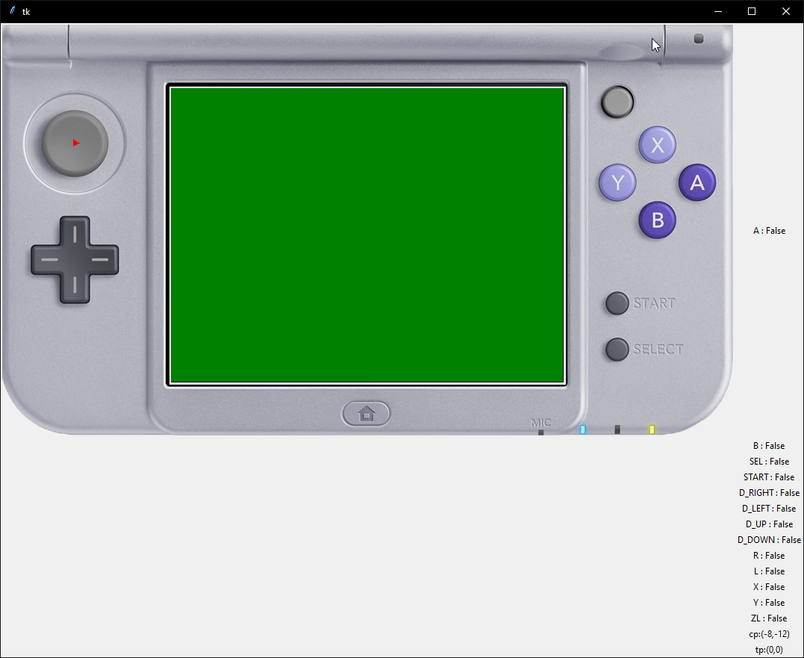

# 3Input - A System Module Input Monitor

3Input is an input viewer that works behind the scenes on your 3DS. Much like [HorizonMod](https://github.com/Bas25/HorizonMod), the goal is to run as a daemoized process/system module, which you can then use a client to connect to and read your inputs. This is essentially an inverse to InputRedirection in [Luma/Rosalina](https://github.com/LumaTeam/Luma3DS/wiki/Rosalina#inputredirection).

## Features
Launch the Launcher, and then connect to the 3DS IP with a client, such as the example [viewer](https://github.com/phlexplexico/3input/viewer/).

The current implementation sends a JSON Object per defined frequency. The JSON object also contains escape sequences so an application can properly decode them. Here is an example as to what the JSON being sent looks like:
```JSON
'{\n\t"btn":268435456,\n\t"cp_x":134,\n\t"cp_y":-68,\n\t"tp_x":0,\n\t"tp_y":0,\n\t"ir_btn":14,\n\t"cpp_x":14,\n\t"cpp_y":14\n}\n'
```

You can then use an application to parse it, to make it more readable like so:
```JSON
{
    "btn":268435456,
    "cp_x":134,
    "cp_y":-68,
    "tp_x":0,
    "tp_y":0,
    "ir_btn":14,
    "cpp_x":14,
    "cpp_y":14
}
```

## Contributors/Credit
- [N3rds](https://github.com/n3rdswithgame) for the entirety of the old codebase. Since then I've been going through and documenting as much as I can to get a further understanding of the codebase itself.
- [leoetlino](https://github.com/leoetlino) for helping with allocation heap and helping with the sysmodule.
- [MarcusD](https://github.com/Bas25/HorizonMod) for HorizonMod. Some code was graciously borrowed within the heap allocation, and a decent reference for running a system module.

## Building
 - Install [devkitPro](http://devkitpro.org/) 3DS tools.
 - `make`
 - [`bannertool`](https://github.com/Steveice10/bannertool/releases) on your `PATH`.
 - [`makerom`](https://github.com/3DSGuy/Project_CTR/releases) on your `PATH`.

 Run `make` in both the `Launcher` directory, and the root directory. Install both `CIAs` on your 3DS, *make sure you're connected to a Wifi Access Point* and launch the Launcher! Now connect with a client (an example is provided in the `viewer` directory). Alternatively, check the [Releases](https://github.com/PhlexPlexico/3input/releases) tab for the files.

## Changing Sending Frequency
The main thread of the module is also reading inputs. If you wish to exit, you can press `SEL+START` to close the application and destroy anything created by it. The following will change the send rate of the inputs:
- `SEL+X` - 140 per second.
- `SEL+Y` - 60 per second.
- `SEL+A` - 10 per second. (Default)
- `SEL+B` - 1 per second.

## Viewing the Output
In order to view this, there is currently a _very_ rudimentary implementation within this repository. There will hopefully be another project in the near future here for client side to show the outputs on PC. 

To run this viewier, please make sure [Python3](https://www.python.org/) is installed. Once you launch 3Input from the Launcher, it will show your IP. Run it by calling `python main.py "127.0.0.1"` where the IP address is your 3DS' IP. 



## TODO
There's a few more things in the TODO pile, and these can be found in the Issues section of GitHub. Most of it is quality of life (i.e. WiFi issues), but there are a few things to improve reading from 3DS Inputs, like gryo.

## License
This project is licensed under [GNU GENERAL PUBLIC LICENSE V3](https://www.gnu.org/licenses/gpl-3.0.en.html). Feel free to distribute, contribute, and make changes! Pull requests to improve functionality is always welcome!